# HealthAI Coach – Stack Monitoring (Grafana + Prometheus)

> **Prometheus · Alertmanager · Grafana · Discord**
> Documentation pédagogique : comprendre **pourquoi** et **comment** fonctionne la supervision du projet.

---

## 📖 Comment lire ce document (sens de lecture)

Ce README se lit **du concept vers le détail**. Si tu débutes en monitoring, suis cet ordre :

1. **[Les 3 idées à comprendre AVANT tout](#1-les-3-idées-à-comprendre-avant-tout)** — le modèle « pull », les exporters, la séparation des rôles. **Ne saute pas cette partie**, tout le reste en découle.
2. **[Vue d'ensemble](#2-vue-densemble)** — le schéma global, qui parle à qui.
3. **[Comment Prometheus récupère les métriques](#3-comment-prometheus-récupère-vraiment-les-métriques)** — la réponse précise à « via Swagger ? via l'output du conteneur ? ».
4. **[Les 8 conteneurs, un par un](#4-les-8-conteneurs-du-stack-un-par-un)** — le rôle de chaque brique.
5. **[Le réseau Docker](#5-architecture-réseau--pourquoi-certaines-sondes-passent-par-le-host)** — pourquoi certaines sondes passent par le host.
6. **[Le voyage d'une métrique](#6-le-voyage-dune-métrique-de-la-source-à-grafana)** — du conteneur jusqu'au graphe Grafana.
7. **[Le voyage d'une alerte](#7-le-voyage-dune-alerte-jusquà-discord)** — de la panne jusqu'au message Discord.
8. **[Grafana en détail](#8-grafana--datasources-dashboards-provisioning)** — datasources, dashboards, provisioning.
9. **[Quel fichier fait quoi](#9-quel-fichier-fait-quoi-le-mapping-complet)** — le mapping fichier → rôle (référence).
10. **[Démo & FAQ](#11-démo-pour-la-présentation)** — pour la soutenance.

> 💡 **Convention des schémas** : une flèche `A --> B` se lit **« A envoie vers B »** ou **« A est lu par B »** selon le libellé porté par la flèche. Lis **toujours le texte sur la flèche**, il précise le sens.

---

## 1. Les 3 idées à comprendre AVANT tout

### Idée n°1 — Prometheus fonctionne en **PULL** (il va chercher), pas en **PUSH** (on lui envoie)

Beaucoup pensent que les applications « envoient » leurs métriques à Prometheus. **C'est l'inverse.**

> **Prometheus va lui-même interroger** chaque cible, à intervalle régulier (ici **toutes les 15 secondes**), via une simple **requête HTTP GET** sur une URL spéciale appelée **`/metrics`**.

Cette opération s'appelle un **scrape** (« raclage »). Prometheus « racle » la page `/metrics` de chaque cible, lit le texte renvoyé, et le range dans sa base de données temporelle (TSDB).

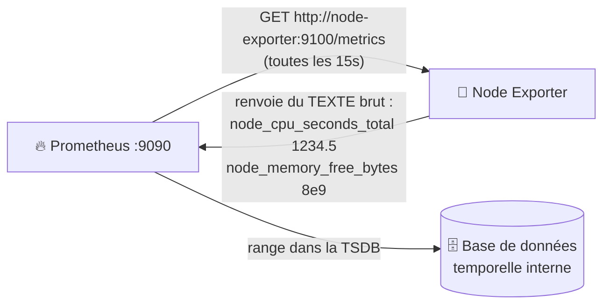

### Idée n°2 — Une application « normale » ne sait PAS parler à Prometheus → on utilise des **exporters**

Prometheus ne comprend qu'**un seul langage** : le **format d'exposition Prometheus** (du texte `nom_metric{label="x"} valeur`).

Or PostgreSQL, MongoDB, le système Linux, Docker… **ne parlent pas ce langage nativement**. On intercale donc des **traducteurs** appelés **exporters** :

> Un **exporter** est un petit programme (dans son propre conteneur) qui :
> 1. interroge un système (ex : PostgreSQL) avec **son** protocole natif,
> 2. **traduit** le résultat en format Prometheus,
> 3. l'expose sur une page **`/metrics`** que Prometheus vient scraper.

C'est exactement pour ça qu'on a 5 exporters (postgres, mongodb, node, cadvisor, blackbox) : ce sont les **adaptateurs** entre les services et Prometheus.

### Idée n°3 — Séparation des rôles : chacun fait UNE chose

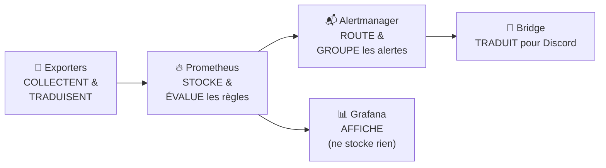

Retiens cette chaîne : **Collecter → Stocker → (Afficher | Alerter)**. Aucune brique ne fait le travail d'une autre. C'est ce qui rend le système **modulaire** : on peut remplacer Grafana sans toucher à Prometheus, ajouter un exporter sans toucher aux alertes, etc.

---

## 2. Vue d'ensemble

Le monitoring surveille **tous les services** du projet en temps réel.
Quand quelque chose ne va pas, une alerte part automatiquement sur Discord.

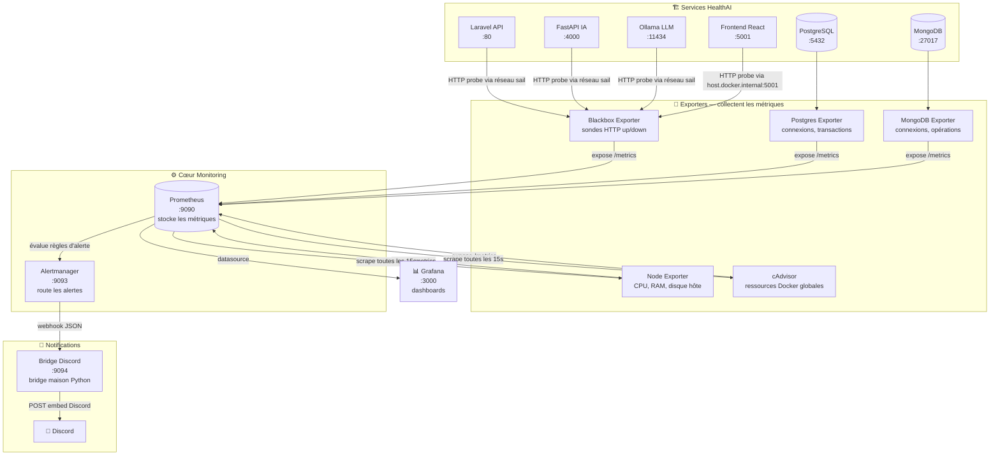

**Comment lire ce schéma (de haut en bas) :**
- **En haut**, les **services** du projet (ce qu'on veut surveiller).
- **Juste en dessous**, les **exporters** : chacun « branché » sur un service, ils exposent une page `/metrics`.
- **Au centre**, **Prometheus** scrape tous les exporters et **stocke** ; il **évalue** en continu les règles d'alerte.
- **À droite**, **Grafana** lit Prometheus pour **dessiner** les graphes (il ne stocke rien).
- **En bas**, la chaîne d'**alerte** : Prometheus → Alertmanager → Bridge → Discord.

> **Pourquoi `host.docker.internal` pour le Frontend ?**
> Le conteneur Frontend est sur le réseau `frontend_default` (réseau isolé créé par son propre compose).
> Les autres services sont sur `healthai_backend_sail`. Le blackbox exporter ne peut pas
> joindre `healthai_frontend` par nom. On passe par le port exposé sur le host (:5001).

---

## 3. Comment Prometheus récupère **vraiment** les métriques

> ❓ **Question fréquente : « Prometheus récupère-t-il les données via le Swagger ? via l'output (les logs) du conteneur ? »**
> **Réponse courte : NI l'un NI l'autre.**

| Idée reçue | Vrai ? | Explication |
|---|---|---|
| Via le **Swagger / OpenAPI** | ❌ **Non** | Le Swagger documente une API REST pour les **humains/devs**. Prometheus ne le lit jamais. |
| Via les **logs / stdout** du conteneur | ❌ **Non** | Prometheus ne lit pas la sortie console des conteneurs (ça, c'est le rôle d'outils comme Loki/ELK). |
| Via une page **HTTP `/metrics`** | ✅ **OUI** | Prometheus fait un `GET …/metrics` et lit un **texte au format Prometheus**. C'est **le seul** mécanisme. |

### Ce que renvoie réellement une page `/metrics`

Quand Prometheus fait `GET http://postgres-exporter:9187/metrics`, il reçoit un **texte brut** comme :

```text
# HELP pg_up Whether the last scrape of metrics from PostgreSQL was successful
# TYPE pg_up gauge
pg_up 1
# HELP pg_stat_database_numbackends Number of backends currently connected
# TYPE pg_stat_database_numbackends gauge
pg_stat_database_numbackends{datname="laravel"} 7
```

Chaque ligne = **un nom de métrique**, des **labels** entre `{}`, et une **valeur** numérique. Prometheus parse ce texte, horodate chaque valeur, et la stocke. **C'est tout.** Pas de magie, pas de Swagger, pas de logs.

### Cas particulier : les applications (Laravel, FastAPI, Ollama) n'ont PAS de `/metrics`

Nos applications **ne sont pas instrumentées** (elles n'exposent pas de page `/metrics` Prometheus). On ne peut donc pas lire leurs métriques internes.

👉 **Solution : le Blackbox Exporter.** Au lieu de demander à l'app « donne-moi tes métriques », on demande au Blackbox : **« va frapper à la porte de cette app et dis-moi si elle répond »**. C'est une sonde **« boîte noire »** (on ne regarde pas l'intérieur, juste si ça répond et en combien de temps).

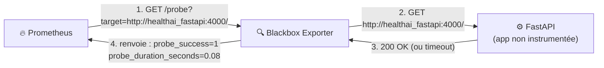

> **À retenir** : pour les bases de données et le système → exporters qui exposent `/metrics`.
> Pour les applications web non instrumentées → blackbox qui les **sonde en HTTP** (up/down + temps de réponse).

### ❓ « Est-ce que Prometheus crée lui-même d'autres conteneurs ? »

**Non, jamais.** Prometheus est un **consommateur passif** : il lit des pages `/metrics`, c'est tout. Il ne lance **aucun** conteneur.

> Ce sont **nous** qui déclarons tous les conteneurs (Prometheus, les exporters, Alertmanager…) dans **`docker-compose.yml`**. C'est **Docker Compose** qui les crée et les démarre. Prometheus, une fois lancé, se contente d'aller scraper les adresses qu'on lui a données dans **`prometheus.yml`**.

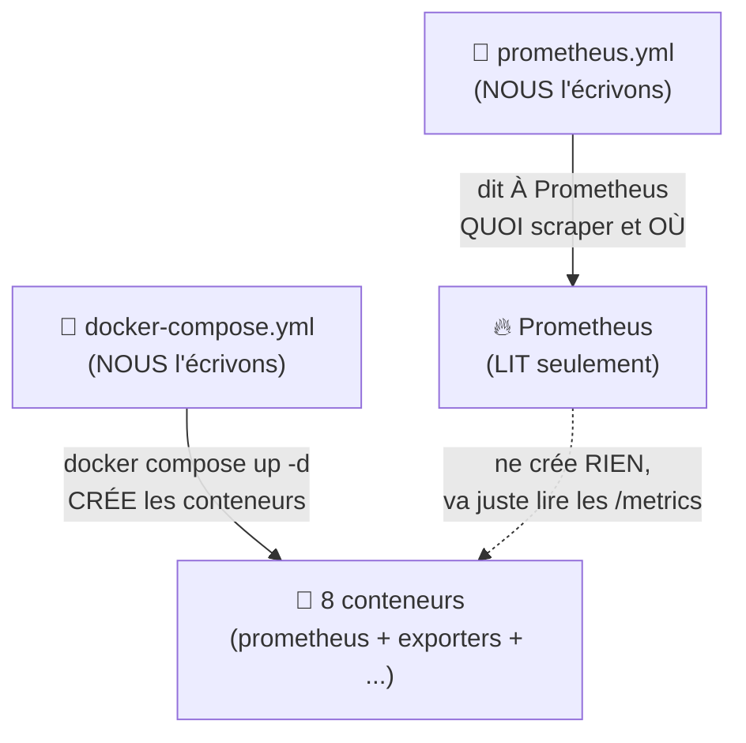

---

## 4. Les 8 conteneurs du stack, un par un

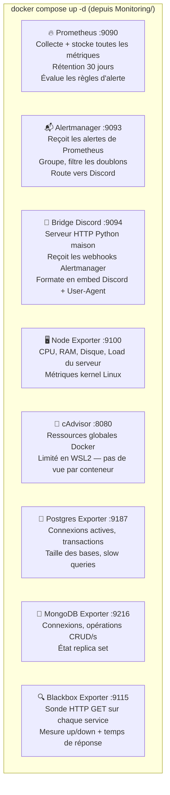

| # | Conteneur | Port | Rôle pédagogique | Type |
|---|---|---|---|---|
| 1 | **Prometheus** | 9090 | Le **cerveau** : scrape, stocke (30j), évalue les alertes | Cœur |
| 2 | **Alertmanager** | 9093 | Le **standardiste** : reçoit les alertes, dédoublonne, route | Cœur |
| 3 | **Bridge Discord** | 9094 | Le **traducteur** : transforme l'alerte en message Discord | Notif |
| 4 | **Node Exporter** | 9100 | Métriques **de la machine hôte** (CPU, RAM, disque) | Exporter |
| 5 | **cAdvisor** | 8080 | Métriques **des conteneurs Docker** (CPU/RAM par conteneur) | Exporter |
| 6 | **Postgres Exporter** | 9187 | Métriques **PostgreSQL** (connexions, transactions) | Exporter |
| 7 | **MongoDB Exporter** | 9216 | Métriques **MongoDB** (connexions, opérations) | Exporter |
| 8 | **Blackbox Exporter** | 9115 | **Sonde HTTP** up/down des applis non instrumentées | Exporter |

> ⚠️ **Grafana ne fait PAS partie de ces 8 conteneurs.** Grafana est lancé ailleurs (avec le reste de la stack applicative). Le stack `Monitoring/` fournit la **donnée** ; Grafana ne fait que **l'afficher**. C'est volontaire : on sépare « produire la métrique » de « la visualiser ».

---

## 5. Architecture réseau — pourquoi certaines sondes passent par le host

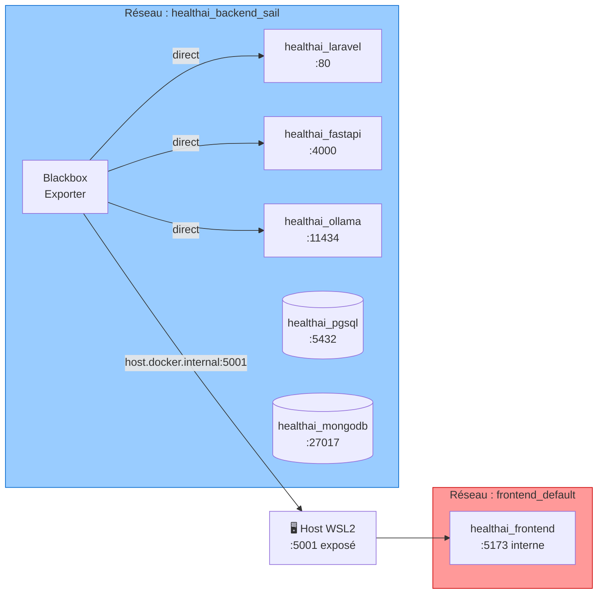

**Pourquoi ce schéma ?** Dans Docker, **deux conteneurs ne se voient par leur nom QUE s'ils sont sur le même réseau**. Le Blackbox vit sur le réseau **`healthai_backend_sail`** (en bleu) ; il atteint donc Laravel/FastAPI/Ollama/PostgreSQL/MongoDB **directement par leur nom de service**.

Mais le **Frontend** (en rouge) a été démarré par **son propre `docker-compose`**, qui l'a mis sur un **autre réseau** (`frontend_default`). Le Blackbox **ne peut pas** l'atteindre par `healthai_frontend`. On contourne en passant par **le port publié sur la machine hôte** (`host.docker.internal:5001`), qui ressort sur le réseau Docker pour retomber sur le Frontend.

> 🎓 **Leçon DevOps** : un service injoignable « par son nom » est presque toujours un **problème de réseau Docker**, pas un bug applicatif. C'est exactement le piège classique « ça marche sur ma machine ».

Le stack monitoring se **rattache** à ce réseau existant grâce à cette déclaration dans `docker-compose.yml` :

```yaml
networks:
  sail:
    external: true            # le réseau existe déjà (créé par le Backend)
    name: healthai_backend_sail
```

`external: true` signifie : **« ne crée pas un nouveau réseau, branche-toi sur celui qui existe déjà »**. C'est ce qui permet aux exporters de parler aux conteneurs applicatifs.

---

## 6. Le voyage d'une métrique (de la source à Grafana)

Suis le chemin **de gauche à droite** : c'est l'ordre chronologique d'une donnée.

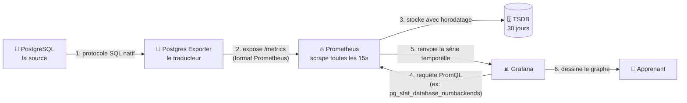

1. **La source** (PostgreSQL) ne connaît pas Prometheus, elle parle SQL.
2. **L'exporter** interroge PostgreSQL en SQL, traduit, et publie une page `/metrics`.
3. **Prometheus** scrape cette page toutes les 15s et **stocke** chaque valeur avec son horodatage.
4. **Grafana** interroge Prometheus avec le langage **PromQL** (le langage de requête de Prometheus).
5. Prometheus renvoie la **série temporelle** (la suite des valeurs dans le temps).
6. Grafana **dessine** la courbe. Grafana **ne stocke rien** : à chaque rafraîchissement, il redemande à Prometheus.

> 🎯 **Point clé** : Grafana est juste une **fenêtre** sur les données de Prometheus. Si Prometheus est vide, Grafana affiche « No data ».

---

## 7. Le voyage d'une alerte (jusqu'à Discord)

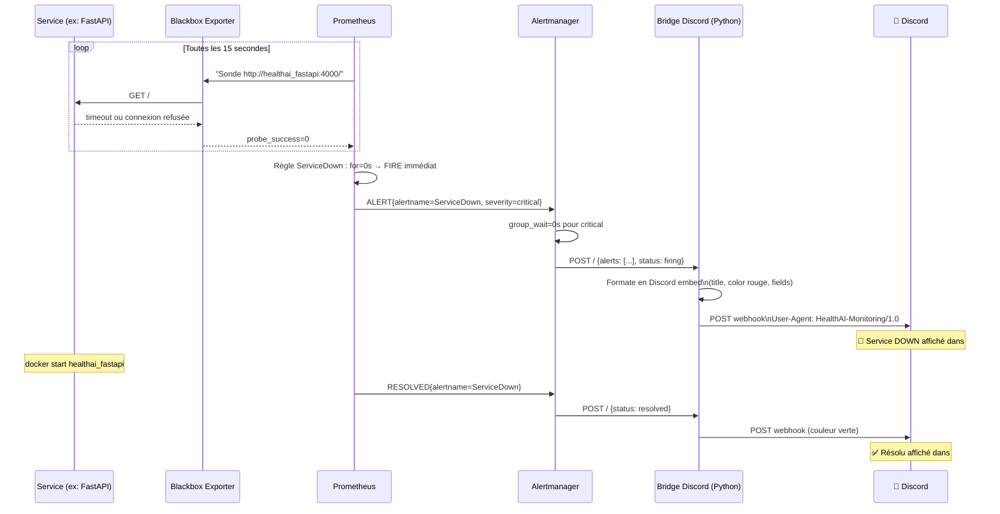

**Qui fait quoi dans cette chaîne (et pourquoi cette séparation) :**

| Étape | Brique | Rôle | Pourquoi pas ailleurs ? |
|---|---|---|---|
| Détecter | **Prometheus** | Évalue les règles (`probe_success == 0`) | C'est lui qui a les données |
| Décider d'alerter | **Prometheus** | `for: 0s` → déclenche immédiatement | La règle vit près de la donnée |
| Router / dédoublonner | **Alertmanager** | Groupe, applique les délais, évite le spam | Séparé pour ne pas alourdir Prometheus |
| Formater pour Discord | **Bridge Python** | Transforme le JSON en embed lisible | Discord a un format précis (voir ci-dessous) |
| Afficher | **Discord** | Notifie l'équipe | Là où l'équipe regarde |

### Pourquoi un bridge Python maison ?

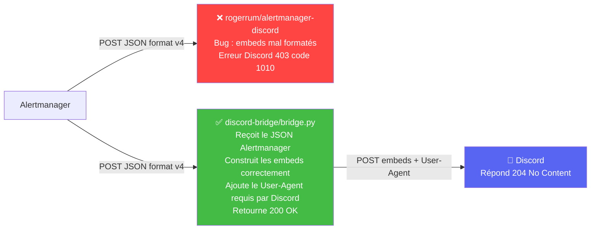

> L'image toute faite `rogerrum/alertmanager-discord` envoyait des embeds mal formés → Discord répondait **403**.
> Notre bridge (`discord-bridge/bridge.py`, **~40 lignes de Python standard, sans dépendance**) génère le bon format **et** ajoute le header **`User-Agent`** exigé par Cloudflare (sinon Discord refuse). C'est un bon exemple de **« quand l'outil tout fait ne marche pas, on écrit 40 lignes maîtrisées »**.

---

## 8. Grafana : datasources, dashboards, provisioning

Grafana est **auto-configuré au démarrage** (« provisioning »), pour ne rien avoir à cliquer à la main. Deux notions :

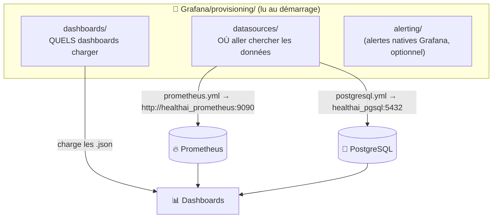

**Deux sources de données, deux usages :**
- **Datasource Prometheus** → dashboards **d'infrastructure** (services up/down, CPU, RAM, conteneurs). C'est le **monitoring technique**.
- **Datasource PostgreSQL** → dashboards **métier** (utilisateurs, aliments, exercices, santé). Grafana fait alors du **SQL directement** sur la base applicative pour des **statistiques métier**.

> 🎓 **Point important** : Grafana peut lire **plusieurs sources**. Ici il combine du **technique** (via Prometheus) et du **métier** (via SQL Postgres). Les deux mondes cohabitent dans la même interface.

**Le piège de l'UID** : chaque dashboard `.json` référence sa datasource par un **UID** (identifiant unique). Si l'UID du provisioning ne correspond pas à celui codé dans le `.json`, le dashboard affiche « datasource not found ». C'est pour ça que `postgresql.yml` fixe l'UID `fficjnp24r8jka` : il doit **matcher** l'UID déjà inscrit dans les 4 dashboards data existants.

### Ce que montre le dashboard d'infrastructure

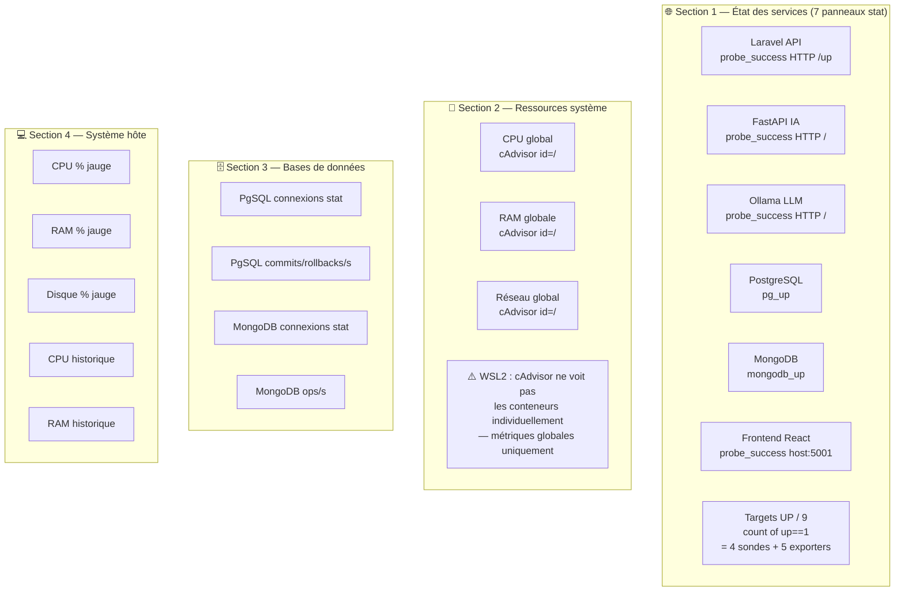

> **Limitation WSL2** : cAdvisor tourne sur WSL2 où le cgroup driver ne permet pas d'isoler les métriques
> par conteneur. On voit les métriques de la machine entière (`id="/"`) — c'est normal, pas un bug.

---

## 9. Quel fichier fait quoi (le mapping complet)

### Fichiers du stack Monitoring (ce dossier)

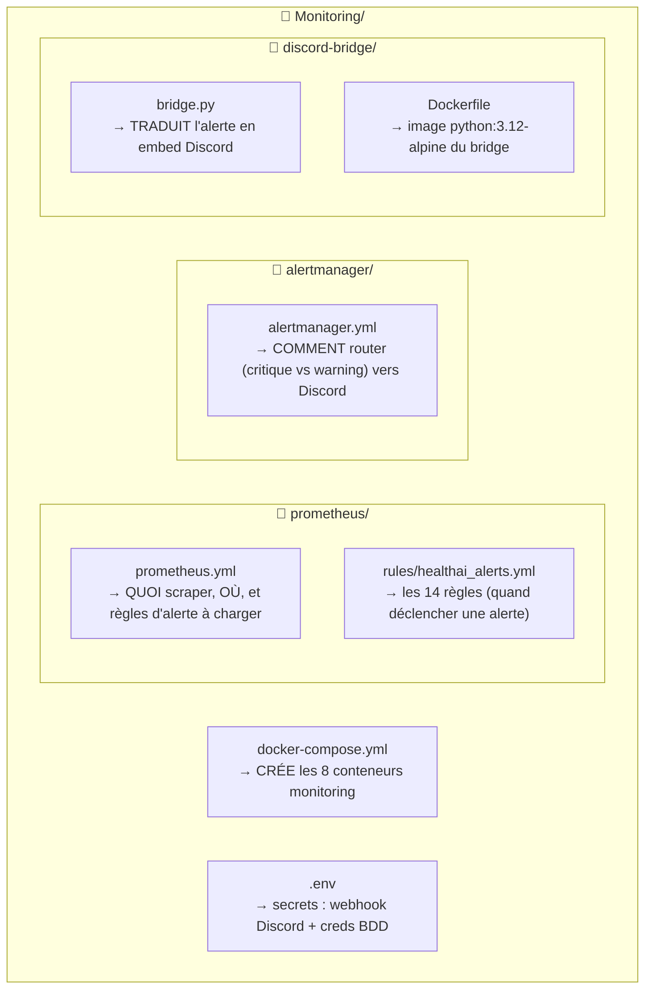

| Fichier | Ce qu'il **permet de faire** | Détail clé |
|---|---|---|
| **`Monitoring/docker-compose.yml`** | **Crée et démarre les 8 conteneurs** (Prometheus, Alertmanager, bridge, 5 exporters) | Se branche sur le réseau existant `healthai_backend_sail` (`external: true`) |
| **`Monitoring/prometheus/prometheus.yml`** | **Dit à Prometheus quoi surveiller** | `scrape_configs` = la liste des cibles + adresses ; `rule_files` = où sont les alertes ; `alerting` = où est Alertmanager |
| **`Monitoring/prometheus/rules/healthai_alerts.yml`** | **Définit les 14 alertes** | Chaque règle = une condition PromQL (ex `probe_success == 0`) + une `severity` + un message |
| **`Monitoring/alertmanager/alertmanager.yml`** | **Route et tempère les alertes** | `group_wait: 0s` pour critique (immédiat), `repeat_interval` (anti-spam), `inhibit_rules` (si DOWN, on tait les warnings du même service) |
| **`Monitoring/discord-bridge/bridge.py`** | **Transforme l'alerte JSON en message Discord** | Serveur HTTP Python (~40 lignes), construit les `embeds`, ajoute le `User-Agent` requis |
| **`Monitoring/discord-bridge/Dockerfile`** | **Empaquette le bridge** en image | `python:3.12-alpine`, aucune dépendance externe |
| **`Monitoring/.env`** | **Fournit les secrets** | `DISCORD_WEBHOOK_URL`, identifiants PostgreSQL/MongoDB (jamais commités) |

### Fichiers Grafana (dans le repo `Grafana/`)

| Fichier | Ce qu'il **permet de faire** |
|---|---|
| **`Grafana/provisioning/datasources/prometheus.yml`** | Connecte **automatiquement** Grafana à Prometheus (`http://healthai_prometheus:9090`, UID `prometheus-healthai`) |
| **`Grafana/provisioning/datasources/postgresql.yml`** | Connecte Grafana à PostgreSQL pour les dashboards **métier** (UID `fficjnp24r8jka`) |
| **`Grafana/provisioning/dashboards/dashboards.yml`** | Déclare les **dossiers** Grafana et charge les `.json` au démarrage |
| **`Grafana/monitoring-dashboards/healthai_monitoring.json`** | Le **dashboard d'infrastructure** (services up/down, CPU, RAM, BDD, hôte) |
| **`Grafana/usersGrafana.json` …** | Les 4 dashboards **métier** (utilisateurs, aliments, exercices, santé) |

### Modifications apportées aux fichiers existants (intégration)

| Fichier | Ce qui a changé | Pourquoi |
|---|---|---|
| [ETL/docker-compose.yml](../ETL/docker-compose.yml) | Grafana : volumes provisioning, env alerting, réseau sail, `MIN_REFRESH_INTERVAL=5s` | Auto-charger datasources + dashboards, permettre refresh 5s |
| [start.sh](../start.sh) | Étape 13/14 : lance `Monitoring/docker-compose.yml` | Démarrage automatique du stack monitoring |
| [Grafana/provisioning/datasources/postgresql.yml](../Grafana/provisioning/datasources/postgresql.yml) | Datasource PostgreSQL avec UID `fficjnp24r8jka` | Correspond à l'UID codé dans les 4 dashboards data existants |
| [Monitoring/prometheus/prometheus.yml](prometheus/prometheus.yml) | Frontend sondé via `host.docker.internal:5001` au lieu de `healthai_frontend:5173` | Frontend sur réseau `frontend_default` inaccessible depuis `sail` |
| [Monitoring/prometheus/rules/healthai_alerts.yml](prometheus/rules/healthai_alerts.yml) | `ServiceDown` : `for: 0s` (au lieu de 2m) | Alerte immédiate pour la démo |
| [Monitoring/alertmanager/alertmanager.yml](alertmanager/alertmanager.yml) | `group_wait: 0s` pour critical | Envoi Discord sans délai |
| [Grafana/monitoring-dashboards/healthai_monitoring.json](../Grafana/monitoring-dashboards/healthai_monitoring.json) | Ajout panneau Frontend, w=3 pour 7 panneaux, refresh=5s, fix queries WSL2 | Frontend visible, rafraîchissement rapide |

---

## 10. Les 14 alertes configurées

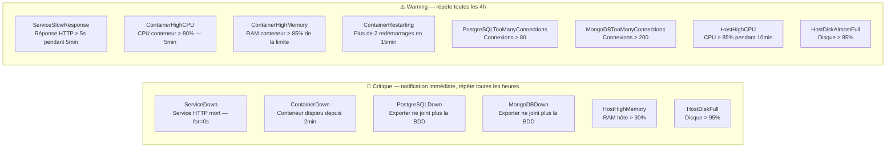

**Comprendre les 2 mots-clés d'une règle :**
- **`severity`** (`critical` / `warning`) → décide de l'urgence et du routage dans Alertmanager.
- **`for`** → durée pendant laquelle la condition doit rester vraie avant de déclencher. `for: 0s` = immédiat (pour la démo) ; `for: 5m` = il faut 5 min de problème continu (évite les fausses alertes sur un pic passager).

---

## 11. Démo pour la présentation

### Timing complet

| T+ | Événement |
|---|---|
| 0s | `docker stop healthai_fastapi` |
| ~15s | Prometheus détecte `probe_success=0` |
| ~15s | Alerte FIRING (for=0s) |
| ~15s | Message Discord 🔴 |
| +60s | `docker start healthai_fastapi` |
| ~75s | Alerte RESOLVED |
| ~75s | Message Discord ✅ |

### Commandes prêtes

```bash
# Déclenche l'alerte (~15s avant Discord)
docker stop healthai_fastapi

# Surveille Prometheus en live (terminal séparé)
watch -n 2 'curl -s http://localhost:9090/api/v1/alerts | python3 -c "
import sys,json
d=json.load(sys.stdin)
alerts=d[\"data\"][\"alerts\"]
print(\"Alertes actives:\", len(alerts))
for a in alerts: print(\" \", a[\"state\"].upper(), a[\"labels\"][\"alertname\"], a[\"labels\"].get(\"instance\",\"\"))
"'

# Résoud l'alerte (~15s avant Discord ✅)
docker start healthai_fastapi
```

### Les URLs à connaître pour la démo

| Interface | URL | À montrer |
|---|---|---|
| **Prometheus** | http://localhost:9090 | Onglet *Status → Targets* (tout est UP), onglet *Alerts* |
| **Alertmanager** | http://localhost:9093 | Les alertes en cours de routage |
| **Grafana** | http://localhost:3000 | Le dashboard *HealthAI Monitoring* |
| **cAdvisor** | http://localhost:8080 | Les métriques Docker brutes |

---

## 12. FAQ pédagogique (questions de jury)

**« Prometheus lit le Swagger ? »**
→ Non. Prometheus fait `GET /metrics` et lit un texte au format Prometheus. Le Swagger est une doc d'API pour les humains, sans rapport.

**« Prometheus lit les logs du conteneur ? »**
→ Non. Lire les logs, c'est le rôle de Loki/ELK. Prometheus ne fait que scraper des pages `/metrics`.

**« Prometheus crée des conteneurs ? »**
→ Non. C'est **Docker Compose** qui crée tous les conteneurs (`docker-compose.yml`). Prometheus ne fait que **lire** les `/metrics` aux adresses listées dans `prometheus.yml`.

**« Pourquoi des exporters et pas directement l'app ? »**
→ Parce que PostgreSQL, MongoDB, le système… ne parlent pas le format Prometheus. L'exporter traduit. Et nos applis web ne sont pas instrumentées → on les sonde de l'extérieur avec Blackbox (up/down + temps de réponse).

**« Que se passe-t-il si la base n'est pas prête au démarrage ? »**
→ Le postgres-exporter renvoie `pg_up=0`, l'alerte `PostgreSQLDown` se déclenche, et un message Discord part. Le monitoring **observe** la panne ; il ne la corrige pas (ce serait le rôle des health checks Docker + `restart: unless-stopped`).

**« Où sont stockées les métriques et combien de temps ? »**
→ Dans la TSDB interne de Prometheus (volume `prometheus_data`), **30 jours** (`--storage.tsdb.retention.time=30d`).

---

### En une phrase
> **Les exporters traduisent, Prometheus collecte et stocke, Grafana affiche, Alertmanager + le bridge préviennent sur Discord — et tout est créé par Docker Compose, pas par Prometheus.**
