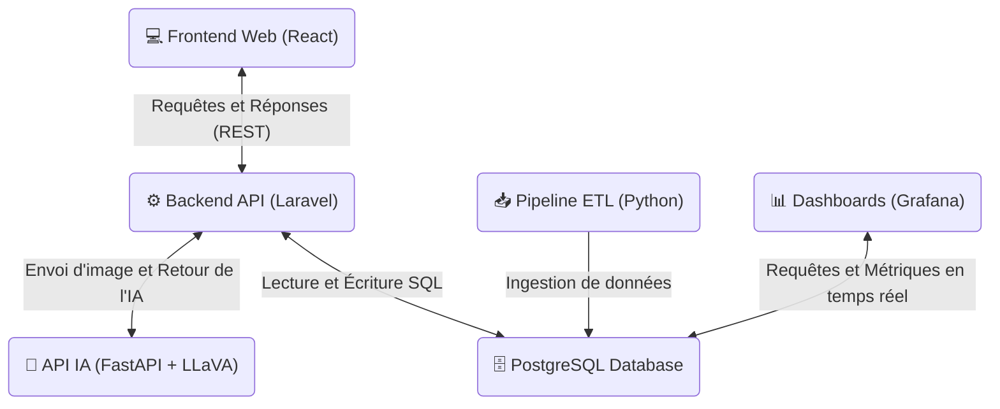

# 🗺️ Architecture Globale - HealthAI Coach

Ce document présente l'architecture macro de la plateforme et la manière dont les différents microservices interagissent entre eux pour assurer le fonctionnement du système.

## Diagramme d'architecture (Flux Applicatifs & Data)

Le système est découpé en deux couches principales : une couche applicative (qui gère l'interface utilisateur et la logique métier de l'IA) et une couche de données (centrée autour de la base de données relationnelle, de l'ingestion ETL et du monitoring).

