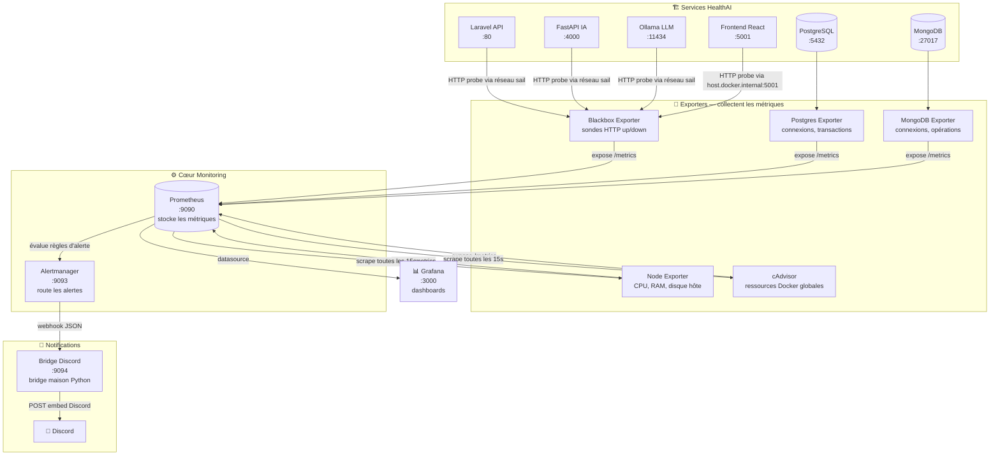
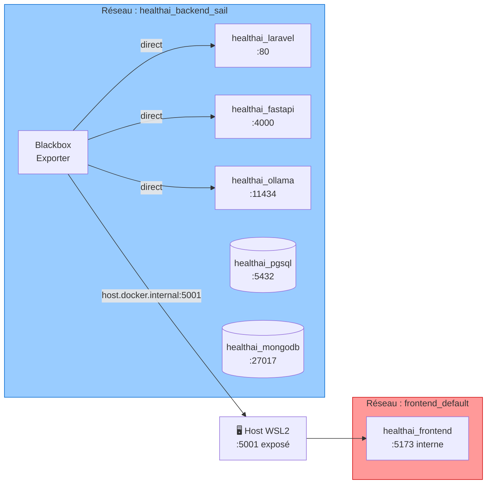
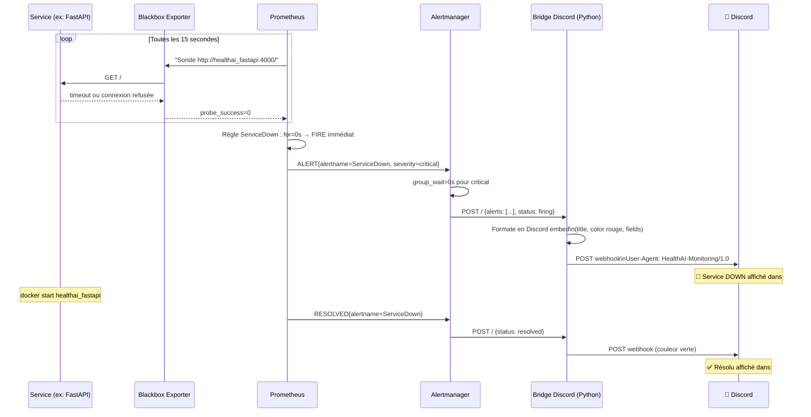
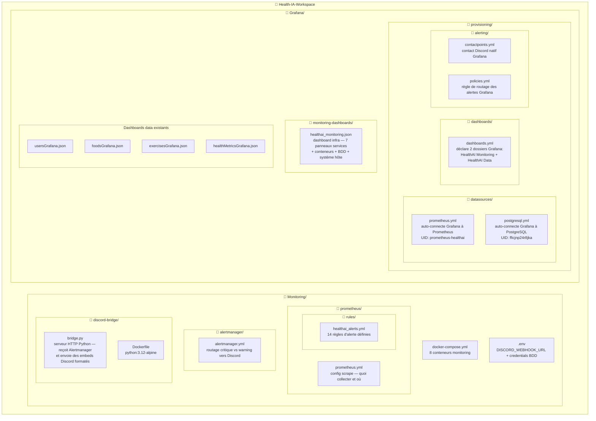
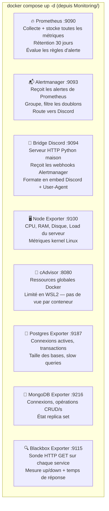
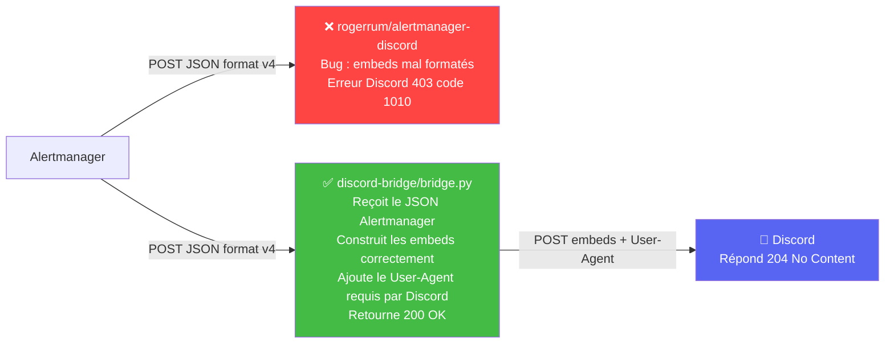
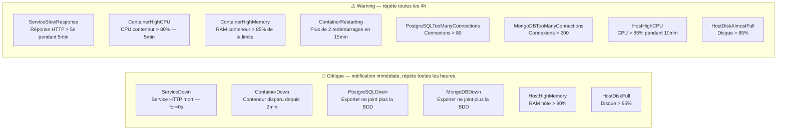
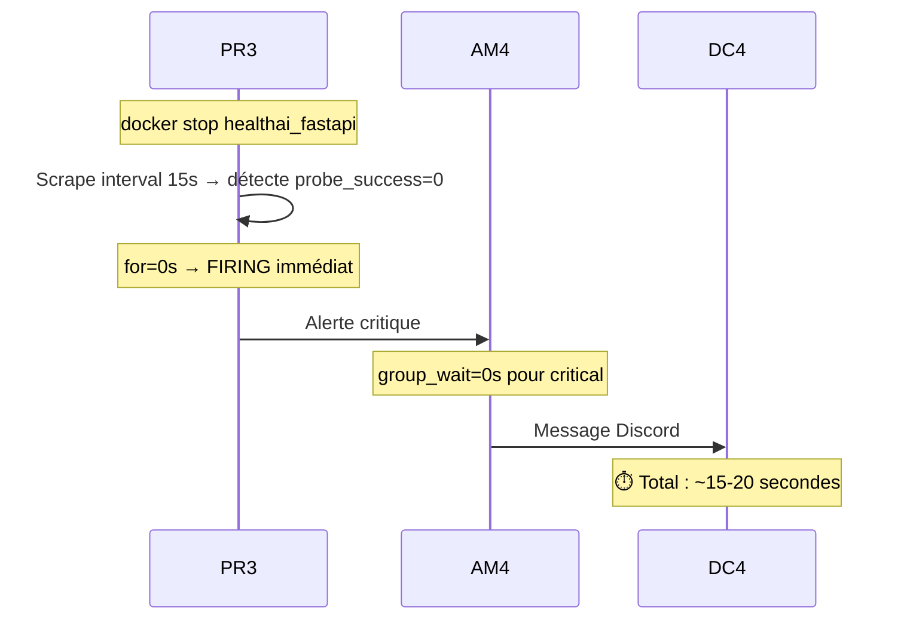
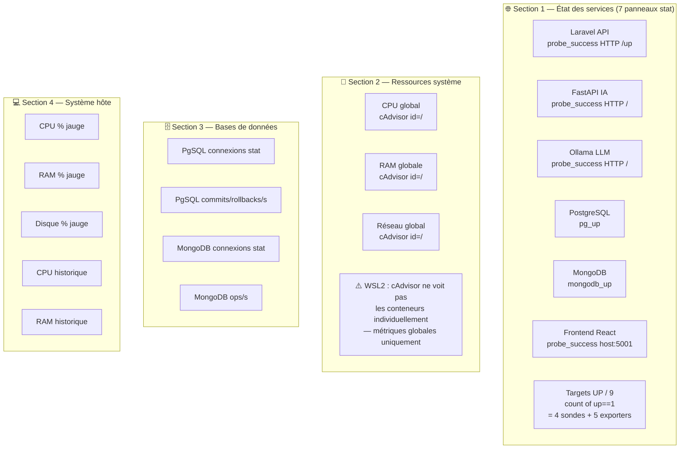

# HealthAI Coach – Stack Monitoring

> Prometheus · Alertmanager · Grafana · Discord

---

## Vue d'ensemble

Le monitoring surveille **tous les services** du projet en temps réel.
Quand quelque chose ne va pas, une alerte part automatiquement sur Discord.



> **Pourquoi `host.docker.internal` pour le Frontend ?**
> Le conteneur Frontend est sur le réseau `frontend_default` (réseau isolé créé par son propre compose).
> Les autres services sont sur `healthai_backend_sail`. Le blackbox exporter ne peut pas
> joindre `healthai_frontend` par nom. On passe par le port exposé sur le host (:5001).

---

## Architecture réseau — pourquoi certaines sondes passent par le host



---

## Séquence complète d'une alerte Discord



---

## Structure complète des fichiers



---

## Les 8 conteneurs du stack Monitoring



---

## Pourquoi un bridge Python maison ?



> L'image `rogerrum/alertmanager-discord` envoyait des embeds mal formés → Discord répondait 403.
> Notre bridge Python génère le bon format et ajoute le header `User-Agent` requis par Cloudflare.

---

## Les 14 alertes configurées



### Timing des alertes pour la démo



---

## Dashboard Grafana — ce qui est affiché



> **Limitation WSL2** : cAdvisor tourne sur WSL2 où le cgroup driver ne permet pas d'isoler les métriques
> par conteneur. On voit les métriques de la machine entière (`id="/"`) — c'est normal, pas un bug.

---

## Démo pour la présentation

### Timing complet

| T+ | Événement |
|---|---|
| 0s | `docker stop healthai_fastapi` |
| ~15s | Prometheus détecte `probe_success=0` |
| ~15s | Alerte FIRING (for=0s) |
| ~15s | Message Discord 🔴 |
| +60s | `docker start healthai_fastapi` |
| ~75s | Alerte RESOLVED |
| ~75s | Message Discord ✅ |

### Commandes prêtes

```bash
# Déclenche l'alerte (~15s avant Discord)
docker stop healthai_fastapi

# Surveille Prometheus en live (terminal séparé)
watch -n 2 'curl -s http://localhost:9090/api/v1/alerts | python3 -c "
import sys,json
d=json.load(sys.stdin)
alerts=d[\"data\"][\"alerts\"]
print(\"Alertes actives:\", len(alerts))
for a in alerts: print(\" \", a[\"state\"].upper(), a[\"labels\"][\"alertname\"], a[\"labels\"].get(\"instance\",\"\"))
"'

# Résoud l'alerte (~15s avant Discord ✅)
docker start healthai_fastapi
```

---

## Modifications apportées aux fichiers existants

| Fichier | Ce qui a changé | Pourquoi |
|---|---|---|
| [ETL/docker-compose.yml](../ETL/docker-compose.yml) | Grafana : volumes provisioning, env alerting, réseau sail, `MIN_REFRESH_INTERVAL=5s` | Auto-charger datasources + dashboards, permettre refresh 5s |
| [start.sh](../start.sh) | Étape 13/14 : lance `Monitoring/docker-compose.yml` | Démarrage automatique du stack monitoring |
| [Grafana/provisioning/datasources/postgresql.yml](../Grafana/provisioning/datasources/postgresql.yml) | Datasource PostgreSQL avec UID `fficjnp24r8jka` | Correspond à l'UID codé dans les 4 dashboards data existants |
| [Monitoring/prometheus/prometheus.yml](prometheus/prometheus.yml) | Frontend sondé via `host.docker.internal:5001` au lieu de `healthai_frontend:5173` | Frontend sur réseau `frontend_default` inaccessible depuis le réseau `sail` |
| [Monitoring/prometheus/rules/healthai_alerts.yml](prometheus/rules/healthai_alerts.yml) | `ServiceDown` : `for: 0s` (au lieu de 2m) | Alerte immédiate pour la démo |
| [Monitoring/alertmanager/alertmanager.yml](alertmanager/alertmanager.yml) | `group_wait: 0s` pour critical | Envoi Discord sans délai |
| [Grafana/monitoring-dashboards/healthai_monitoring.json](../Grafana/monitoring-dashboards/healthai_monitoring.json) | Ajout panneau Frontend, w=3 pour 7 panneaux, refresh=5s, fix queries WSL2 | Frontend visible, rafraîchissement rapide |
