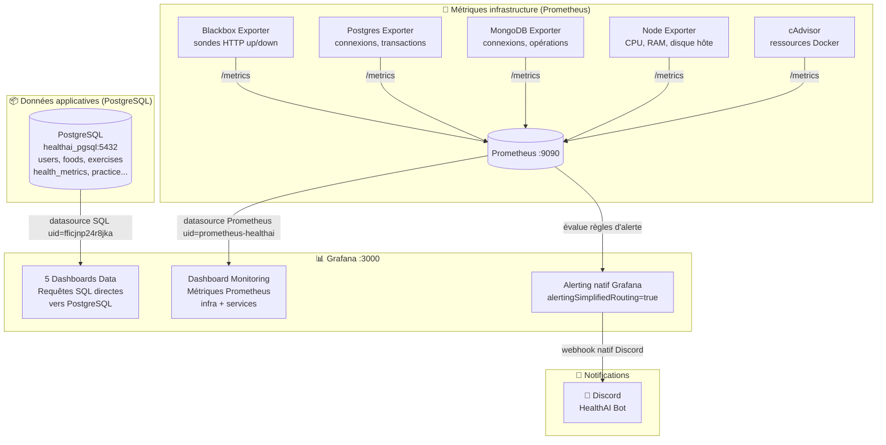
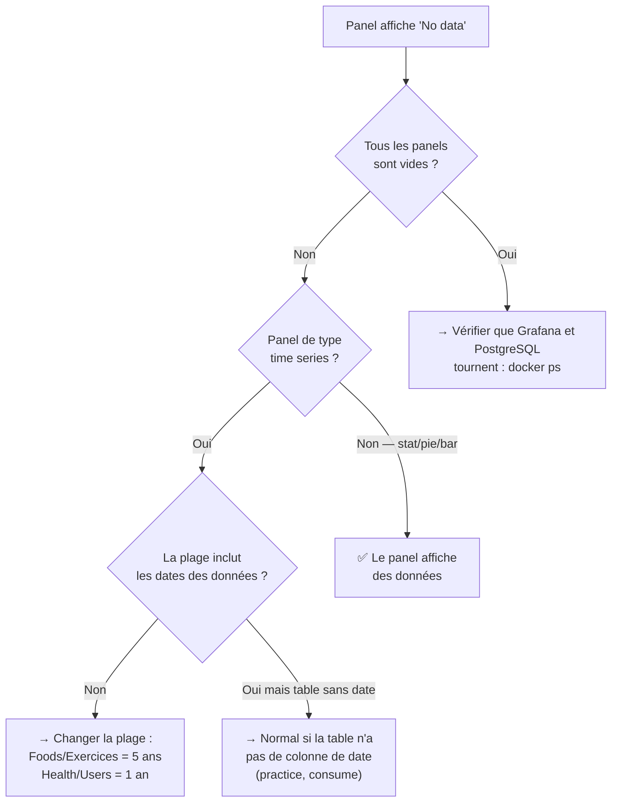
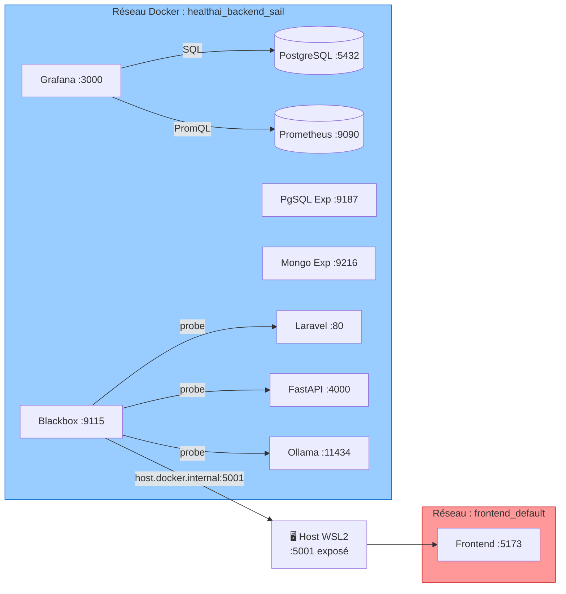
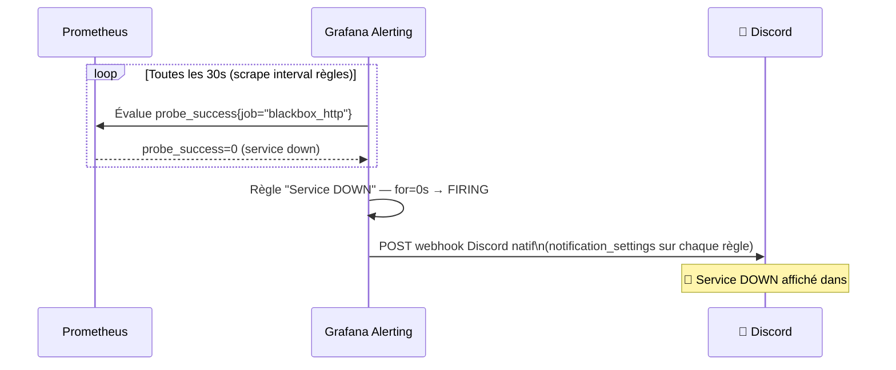

# HealthAI Coach – Stack Monitoring & Dashboards Grafana

> Prometheus · Grafana · Discord · PostgreSQL

---

## Vue d'ensemble



---

## Les 5 dashboards Grafana

Tous accessibles sur [http://localhost:3000](http://localhost:3000) → dossier **HealthAI Data** et **HealthAI Monitoring**.

| Dashboard | Source | Plage par défaut | Données disponibles |
|---|---|---|---|
| **Dashboard – Utilisateurs** | PostgreSQL `users` | Dernière année | 2 users créés le 2026-06-29 |
| **Dashboard – Foods** | PostgreSQL `foods` + `consume` | 5 dernières années | 250 aliments (2021–2026), 30 consommations |
| **Dashboard – Exercices** | PostgreSQL `exercises` + `practice` | 5 dernières années | 250 exercices, 40 séances |
| **Dashboard – Health metrics** | PostgreSQL `health_metrics` | Dernière année | 30 entrées (janv.–avr. 2026) |
| **HealthAI Coach – Application** | PostgreSQL (multi-tables) | Derniers 30 jours | Synthèse globale |
| **HealthAI Coach – Monitoring** | Prometheus | Dernière heure | Temps réel — infra + services |

---

## ❓ Pourquoi je n'ai pas de données dans mes panels ?

### Raison 1 — La plage de dates ne couvre pas les données

C'est la cause la plus fréquente. Chaque panel filtre les données sur la plage horaire visible en haut à droite de Grafana.

**Les données PostgreSQL ont ces dates réelles :**

| Table | Colonnes avec dates | Plage des données en base |
|---|---|---|
| `users` | `created_at` | 2026-06-29 (les 2 users ont été créés le même jour) |
| `foods` | `created_at` | 2021-06-19 → 2026-06-15 (étalées sur 5 ans) |
| `exercises` | `created_at` | 2021 → 2026 |
| `health_metrics` | `date` | 2026-01-11 → 2026-04-26 |
| `practice` | ❌ **pas de date** | — (impossible de faire une time series) |
| `consume` | ❌ **pas de date** | — (impossible de faire une time series) |

**Ce qu'il faut faire :** Sélectionner la bonne plage dans le sélecteur en haut à droite.

```
Dashboard Utilisateurs  → sélectionner "Last 1 year"
Dashboard Foods         → sélectionner "Last 5 years"
Dashboard Exercices     → sélectionner "Last 5 years"
Dashboard Health metrics → sélectionner "Last 1 year"  (ou "2026-01-01 → now")
```

> Les plages par défaut sont déjà configurées correctement dans les fichiers JSON.
> Si tu vois "No data", c'est souvent parce que tu as changé la plage manuellement.

---

### Raison 2 — Très peu de données de démo

La base de données ne contient que des données de test :

```
users          →   2 utilisateurs
exercises      → 250 exercices (bien rempli ✅)
foods          → 250 aliments (bien rempli ✅)
practice       →  40 séances pratiquées
health_metrics →  30 entrées (métriques santé)
consume        →  30 consommations alimentaires
subscriptions  →   2 (Free × 1, Premium × 1)
roles          →   3 (admin × 1, coach × 1, user × 0)
```

Les panels de type **time series** vont afficher des barres très espacées (1 point tous les 10 jours environ).
Les panels de type **stat** (chiffre unique) fonctionneront toujours, quelle que soit la plage.

---

### Raison 3 — Tables sans colonne de date (`practice`, `consume`)

Ces deux tables n'ont **pas de `created_at`** en base :

```sql
-- practice : practice_id, user_id, exercise_id, deleted_at
-- consume  : consume_id,  user_id, food_id,     deleted_at
```

Il est donc **impossible** de tracer un graphique temporel "séances par jour" ou "scans par jour".
Les panels concernés utilisent à la place des **compteurs totaux** (stat panels) ou des jointures sur d'autres tables.

---

### Raison 4 — Datasource PostgreSQL non connectée

Si **tous** les panels Data affichent "No data" en même temps → la datasource SQL est coupée.

**Vérification :**
```bash
# 1. Est-ce que Grafana tourne ?
docker ps | grep grafana

# 2. Est-ce que PostgreSQL est accessible ?
docker ps | grep pgsql

# 3. Test direct dans Grafana :
#    Aller dans Configuration → Data sources → HealthAI PostgreSQL → "Test"
```

Si le test échoue, c'est que le conteneur `healthai_pgsql` n'est pas sur le réseau `sail` ou n'est pas démarré.

**Solution :**
```bash
cd /home/diana/Health-IA-Workspace
./start.sh 

# ou uniquement Grafana
cd ETL && docker compose up -d grafana
```

---

### Raison 5 — Scans IA (LLaVA) non tracés en base

Le panel "Scans IA via LLaVA" utilise la table `consume` comme **proxy** car les scans alimentaires effectués par LLaVA/Ollama ne sont pas persistés dans PostgreSQL.

Si les scans IA sont stockés dans MongoDB, il faudrait ajouter une datasource MongoDB dans Grafana.
En l'état : le chiffre affiché = nombre d'entrées dans `consume` (30).

---

## Résumé rapide — quoi vérifier quand un panel est vide



---

## Architecture réseau



> **Frontend sur réseau isolé** : Le frontend React tourne sur `frontend_default`, inaccessible depuis le réseau `sail`.
> La sonde HTTP passe par le port exposé sur le host (`:5001`), c'est pourquoi elle peut retourner HTTP 403
> depuis Docker (Vite dev server restreint par origine) mais 200 en local — c'est attendu, pas un bug.

---

## Alerting Grafana → Discord

L'alerting est géré **nativement par Grafana** (pas par Alertmanager) grâce au feature toggle `alertingSimplifiedRouting`.



**Pourquoi `notification_settings` sur chaque règle ?**
Avec `alertingSimplifiedRouting=true`, Grafana exige que chaque règle déclare son contact point directement.
Sans ça, les alertes "firing" ne déclenchent pas de notification même si une policy globale existe.

### Les 7 alertes Grafana configurées

| Alerte | Seuil | Délai | Répétition |
|---|---|---|---|
| Service DOWN | `probe_success < 1` | for=0s | toutes les heures |
| Service LENT | `probe_duration > 2s` | for=2min | toutes les 4h |
| PostgreSQL DOWN | `pg_up = 0` | for=30s | toutes les heures |
| MongoDB DOWN | `mongodb_up = 0` | for=30s | toutes les heures |
| PostgreSQL connexions | `pg_stat_activity_count > 80` | for=5min | toutes les 4h |
| RAM hôte > 90% | node memory | for=5min | toutes les heures |
| Disque hôte > 85% | node disk | for=5min | toutes les 4h |

---

## Démo pour la présentation

### Déclencher une alerte (~15 secondes avant Discord)

```bash
# Stopper un service pour déclencher l'alerte
docker stop healthai_fastapi

# Observer Prometheus en live
watch -n 2 'curl -s http://localhost:9090/api/v1/alerts | python3 -c "
import sys,json
d=json.load(sys.stdin)
alerts=d[\"data\"][\"alerts\"]
print(\"Alertes actives:\", len(alerts))
for a in alerts: print(\" \", a[\"state\"].upper(), a[\"labels\"][\"alertname\"])
"'

# Résoudre l'alerte
docker start healthai_fastapi
```

### Timing complet

| T+ | Événement |
|---|---|
| 0s | `docker stop healthai_fastapi` |
| ~15–30s | Grafana évalue la règle → FIRING |
| ~30s | Message Discord 🔴 Service DOWN |
| +60s | `docker start healthai_fastapi` |
| ~75–90s | Message Discord ✅ Résolu |

---

## Stack Monitoring — les conteneurs

| Conteneur | Port | Rôle |
|---|---|---|
| `prometheus` | :9090 | Collecte et stocke les métriques infra (rétention 30j) |
| `node-exporter` | :9100 | CPU, RAM, disque, load du serveur hôte |
| `cadvisor` | :8080 | Ressources Docker globales *(WSL2 : métriques globales uniquement)* |
| `postgres-exporter` | :9187 | Connexions actives, transactions, taille BDD |
| `mongodb-exporter` | :9216 | Connexions, opérations CRUD/s, état replica set |
| `blackbox-exporter` | :9115 | Sondes HTTP GET sur chaque service (up/down + latence) |

> **Limitation WSL2** : cAdvisor ne peut pas isoler les métriques par conteneur sur WSL2 (cgroup driver limité).
> Les panels CPU/RAM Docker affichent les métriques de la machine entière (`id="/"`) — comportement normal.

---

## Structure des fichiers

```
Health-IA-Workspace/
├── Monitoring/
│   ├── docker-compose.yml          ← 6 conteneurs monitoring (Prometheus + exporters)
│   ├── .env                        ← DISCORD_WEBHOOK_URL + credentials BDD
│   ├── prometheus/
│   │   └── prometheus.yml          ← config scrape (quoi collecter et où)
│   └── alertmanager/
│       └── alertmanager.yml        ← config alertmanager (non utilisé pour Grafana alerting)
│
├── Grafana/
│   ├── provisioning/
│   │   ├── datasources/
│   │   │   ├── prometheus.yml      ← auto-connecte Grafana à Prometheus (uid: prometheus-healthai)
│   │   │   └── postgresql.yml      ← auto-connecte Grafana à PostgreSQL (uid: fficjnp24r8jka)
│   │   ├── dashboards/
│   │   │   └── dashboards.yml      ← déclare les 2 dossiers : HealthAI Monitoring + HealthAI Data
│   │   └── alerting/
│   │       ├── rules.yml           ← 7 règles d'alerte Grafana (avec notification_settings)
│   │       ├── contactpoints.yml   ← contact point Discord natif Grafana
│   │       └── policies.yml        ← politique de routage globale
│   ├── monitoring-dashboards/
│   │   └── healthai_monitoring.json ← dashboard infra Prometheus
│   └── data-dashboards/
│       ├── usersGrafana.json        ← utilisateurs, rôles, inscriptions
│       ├── foodsGrafana.json        ← aliments, macros, consommations
│       ├── exercisesGrafana.json    ← exercices, pratiques, difficulté
│       ├── healthMetricsGrafana.json ← IMC, poids, BPM, activité
│       └── appGrafana.json          ← vue synthèse application globale
│
└── ETL/
    └── docker-compose.yml           ← Grafana (monte les provisioning + data-dashboards)
```

---

## Modifications apportées aux fichiers existants

| Fichier | Ce qui a changé | Pourquoi |
|---|---|---|
| `ETL/docker-compose.yml` | Volume `data-dashboards`, `env_file` pour Discord, `alertingSimplifiedRouting` | Auto-charger datasources + alerting Discord natif |
| `Grafana/provisioning/alerting/rules.yml` | `notification_settings` sur chaque règle | Obligatoire avec `alertingSimplifiedRouting=true` |
| `Grafana/provisioning/alerting/contactpoints.yml` | URL Discord hardcodée (pas de variable d'env) | Grafana 13.0.2 n'interpole pas les variables dans ce fichier |
| `Grafana/data-dashboards/` | Nouveau dossier avec les 5 JSON dashboards data | Séparation des providers pour éviter le conflit "Cannot change resource manager" |
| `Monitoring/prometheus/prometheus.yml` | Frontend sondé via `host.docker.internal:5001` | Frontend sur réseau `frontend_default` inaccessible depuis `sail` |
