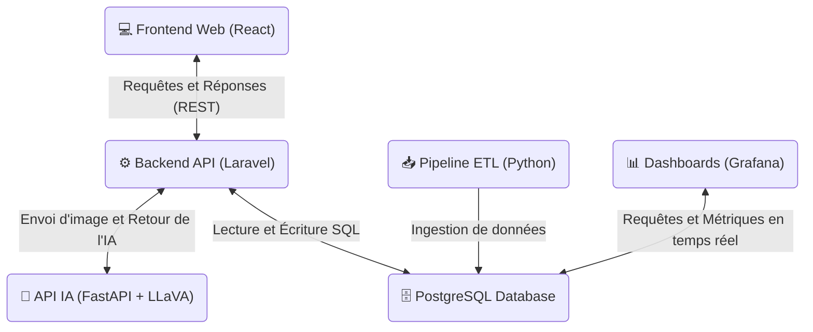

# 🚀 Health-IA-Workspace - Orchestration & Guide de Démarrage Global

**Dépôt principal (Workspace)** de la plateforme HealthAI Coach.  
Ce repository orchestre et centralise l'ensemble des microservices du projet (Backend, Frontend, ETL, API IA et Monitoring) pour permettre un déploiement simple, rapide et reproductible.


---

## 📋 Table des matières

- [Vue d'ensemble](#vue-densemble)
- [Architecture](#architecture)
- [Prérequis](#prérequis)
- [Démarrage rapide (Recommandé)](#démarrage-rapide-recommandé)
- [Configuration des ports](#configuration-des-ports)
- [Arrêt et redémarrage](#arrêt-et-redémarrage)
- [Troubleshooting (Résolution des problèmes)](#troubleshooting-résolution-des-problèmes)
- [Checklist opérationnelle](#checklist-opérationnelle)

---

## Vue d'ensemble

Bienvenue dans le projet **HealthAI Coach**.

Le but de ce workspace est de fournir une solution clé en main pour lancer simultanément toutes les briques applicatives de la plateforme.

Le guide et les scripts associés sont pensés principalement pour un environnement :

- Windows
- Docker Desktop
- WSL2 (recommandé)

afin de garantir une mise en route simple et reproductible pour l'ensemble des développeurs.

---

## Architecture

Le projet global est articulé autour de **4 stacks Docker principales** et de plusieurs sous-modules interconnectés.

---

### 1. Stack Back & Data

`Health-IA-Backend`
  - API REST construite sous Laravel 12
  - Base de données PostgreSQL 15
 
---

### 2. Stack Front

`Health-IA-Frontend`
  - Développée avec React 19, Vite & NodeJs 20+
  - Interface utilisateur web

---

### 3. Stack Pipeline & Monitoring

`Health-IA-ETL`
  - Pipeline Python autonome
  - Extraction des fichiers depuis Google Drive
  - Transformation avec Pandas
  - Load en base de données

`Health-IA-Grafana`
  - Dashboards préconfigurés
  - Monitoring des utilisateurs
  - Visualisation des métriques santé
 
---

### 4. Stack FastAPI & IA

`Health-IA-FastAPI`
  - Microservice IA local
  - Ollama (pull d'un model LLaVA)
  - Analyse nutritionnelle des repas

---

### Diagramme de flux


---

## Prérequis

Pour exécuter correctement l'ensemble des services, assurez-vous de disposer des éléments suivants :

- 💻 **Système d'exploitation**
  - Windows
  - WSL2 recommandé

- 🐳 **Docker Desktop**
  - installé
  - démarré

- 🛠️ **Docker Compose v2**
  - disponible dans le terminal
  - commande :

```bash
docker compose
```

---

## Démarrage rapide (Recommandé)

Le déploiement est entièrement automatisé par un script d'orchestration situé à la racine du workspace.

### Étapes

1. Ouvrez le dossier racine :

```text
Health-IA-Workspace
```

2. Lancez le script d'initialisation :

```bash
start.bat
```

---

## Ce que fait automatiquement `start.bat`

Le script :

- clone tous les repos (back, front, etl, fast-api, grafana)
- démarre l'API Backend
- démarre PostgreSQL
- attend que PostgreSQL soit prêt
- répare automatiquement les anciens clusters incompatibles
- exécute les migrations et seeders Laravel
- génère la clé back & optimize Laravel
- démarre le Front React
- démarre l'ETL & Grafana
- démarre l'API IA avec FastAPI
- démarre Ollama
- télécharge le model LLaVA de Ollama

---

## Configuration des ports

Afin d’éviter les conflits avec des services locaux déjà présents sur la machine hôte, certains ports ont été personnalisés.

| Service | Port Externe (Hôte) | Port Interne (Conteneur) | Description |
|----------|--------------------|--------------------------|-------------|
| API Backend (Laravel) | `8080` | `80` | Point d'entrée API REST |
| PostgreSQL Docker | `55432` | `5432` | Évite le conflit avec PostgreSQL local |
| Frontend Web (React) | `5001` | `5173` | Interface utilisateur |
| API IA (FastAPI) | `4000` | `4000` | Analyse IA des repas |
| Ollama Server | `11434` | `11434` | Serveur LLM local |
| Grafana | `3000` | `3000` | Dashboards de monitoring |

---

## Arrêt et redémarrage

### Arrêt complet des services

Pour stopper proprement l'intégralité des conteneurs :

```bash
# Arrêt de la stack principale

cd HealthAI-Coach
docker compose down

# Arrêt de la stack ETL & Monitoring

cd ..\ETL
docker compose down
```

---

### Redémarrage

Pour relancer proprement toute la plateforme :

```bash
start.bat
```

---

## Troubleshooting (Résolution des problèmes)

---

### A) Impossible de se connecter à PostgreSQL

#### Vérifications

Assurez-vous que :

- vous utilisez bien le port :

```text
55432
```

et non :

```text
5432
```

- votre Data Source IDE est correctement configurée
- le conteneur PostgreSQL tourne correctement :

```bash
docker ps
```

---

### B) Ancien cluster PostgreSQL incompatible

Le script `start.bat` tente automatiquement une réparation via :

```text
HealthAI-Coach/docker/repair-postgres.sql
```

---

### Réinitialisation complète PostgreSQL

```bash
cd HealthAI-Coach

docker compose down -v

docker compose up -d --force-recreate

docker compose exec -T laravel.test php artisan migrate --seed
```

> ⚠️ Attention :
> Cette opération supprime totalement les volumes Docker PostgreSQL.

---

### C) L'ETL ne charge aucun fichier

#### Vérifiez :

- les Folder IDs Google Drive dans :

```text
ETL/.env
```

- la validité du token OAuth :

```text
token.pickle
```

- la variable :

```env
DATABASE_URL=
```

- les logs générés dans le dossier Google Drive :

```text
Log/
```

---

## Checklist opérationnelle

Avant de valider votre environnement :

- [ ] Docker Desktop est actif
- [ ] Docker possède suffisamment de RAM pour Ollama
- [ ] Tous les fichiers `.env` ont été créés depuis `.env.example`
- [ ] `start.bat` s’exécute sans erreur bloquante
- [ ] Laravel répond correctement
- [ ] Le modèle `llava` est installé dans Ollama

---

## 👥 Équipe

Développeurs MSPR :

- Ilan
- Anthony
- Diana

---

## 📄 Licence

Ce projet est sous licence MIT. Voir le fichier [LICENSE](LICENSE) pour plus de détails.

---

## 🔗 Liens des sous-modules

Pour obtenir des détails spécifiques sur chaque composant :

- 🏢 **Organisation** : GroupMSPR
- 💻 **Frontend** : Health-IA-Frontend
- ⚙️ **Backend Laravel** : Health-IA-Backend
- 🧠 **Pipeline ETL** : Health-IA-ETL
- 📷 **Microservice IA** : Health-IA-FastAPI
- 📊 **Monitoring** : Health-IA-Grafana

---

## 📚 Documentation Technique Approfondie

Pour explorer plus en détail la conception technique et conceptuelle du projet, consultez les guides dédiés dans le dossier `docs/` :

- 🗺️ [Architecture Globale & Flux de communication](docs/architecture-globale.md)
- 🛠️ [Justification des choix technologiques](docs/choix-techniques.md)
- 🗄️ [Structure de la base de données & Dictionnaire de données](docs/dictionnaire-donnees.md)

---

Dernière mise à jour : 29 mai 2026

Pour toute question ou contribution, consultez le repository ou ouvrez une issue.
